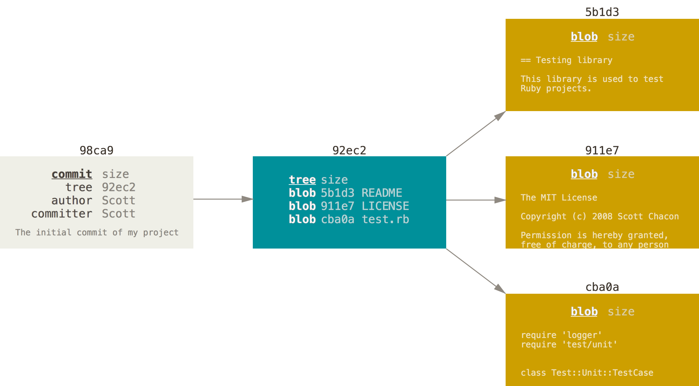
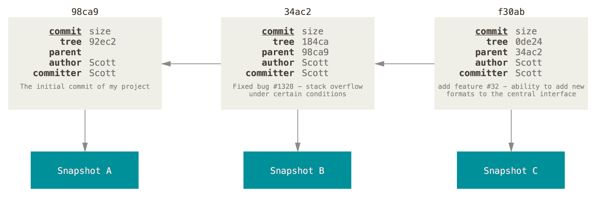
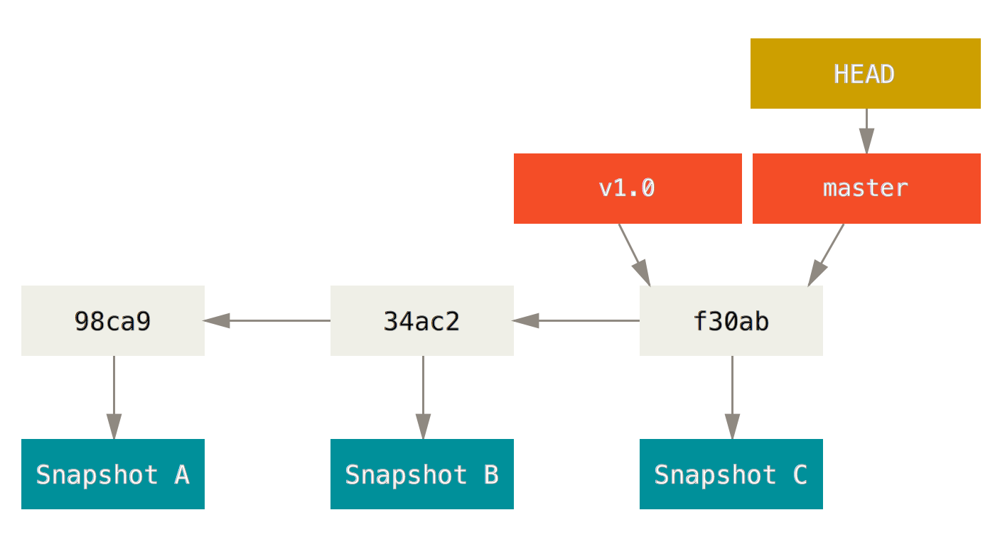

# Source Code Management

### Andrea Galbusera

***

gizero@gmail.com

[@gizero76](https://twitter.com/gizero76)

https://github.com/gizero

---

# The Speaker

embedded systems designer/architect

spare time full-stack web developer

doing SCM since 2002 (in some way teaching it)

using `git` since 2010

doing research into SCM technologies and best practices

---

This presentation is available at:

http://gizero.github.io/scm-course-ff3d/

Sources:

https://github.com/gizero/scm-course-ff3d/

---

# Agenda

## Day 1
- disclaimer
- what's this all about?
- (brief) history of SCM
- workshop

--->

# Agenda

## Day 2
- advanced workflows
- workshop

---

# Disclaimers

- work in progress teaching experiment
<!-- .element: class="fragment" data-fragment-index="1" -->

- many concept are tool agnostic...
<!-- .element: class="fragment" data-fragment-index="2" -->

- ...but this is about `git`
<!-- .element: class="fragment" data-fragment-index="3" -->

- client agnostic
<!-- .element: class="fragment" data-fragment-index="4" -->

- ...but heavily biased towards command line
<!-- .element: class="fragment" data-fragment-index="5" -->

Note: Avertenze

---

# In This Course We

- talk interactively to each other
- sketch some diagrams
- build a reasonable work flow strategy

---

# Then...

- you will learn the commands to implement it

Note: invece di concentrarsi sui comandi ci focalizzeremo maggiormente sul
perchè vogliamo fare qualcosa e poi su come implementarla. Useremo qualche
diagramma per stimolare gli stessi processi di apprendimento che normalmente
portano alcuni di noi a preferire le GUI rispetto alle interfacce CLI.

---

# Vocabulary

- Source Control
- Version Control
- Revision Control
- Source Code Management

Note: con il termine SCM comprendiamo anche pratiche e strumenti più o meno
correlati con il controllo di revisione, quali il deployment e il ticket/issue
tracking. Quindi vediamo cosa ci permettono di fare questi strumenti che rientrano
nella classificazione appena introdotta...

---

# With SCM tools we...

- keep track of changes over time
- backup older files
- work with others on a project simultaneously
- keep track of authorship
- deal with big (or even small) changes that break things
- move things from one host to another

---

# working solo?

- productivity tool
- easily switch between tasks
  + parallelizing activities
- quickly react to urgencies
  + make a quick fix while working on a new feature

---

# working in team?

- don't step on each other's feet
- minimize coordination overhead
- reduce onboarding costs for new resources
- leverage and improve team skills with peer review

---

# Authorship

- keep track of "who made what"
- allow "blaming" changesets

---

# do I really need a tool? (alternatives)

Frequently backup your files (caveman's SCM)

- straightforward: anyone knows how to do it
- error prone (write to wrong dir)
- what does frequently mean?
- how to deal with backups (housekeeping)
- hard to find useful things among backups
- doesn't solve the collaboration issue

---

# Distributed vs Centralized

--->

# Centralized VCS

- there is only one repository every contributor connects to
- there is a single history of revisions
- easy to administer and manage access control
- single point of failure

--->

# Centralized VCS

- SVN
- TFS
- CVS

--->

# Distributed VCS

- every contributor mirrors the entire history
- every clone is a full backup

--->

# Distributed VCS

- git
- Mercurial
- BitKeeper
- Veracity

---

## Distributed as the New Centralized

--->

## Integration Manager

--->

## Dictator and Lieutenants

---

# Exercise 1: outline your team

Who is in your team?

Note: dare un'idea di cosa vogliamo fare senza svelare i dettagli. Cerchiamo di
conoscere il team e il teamwork per caratterizzare i workflow di interesse.
Usiamo come riferimento un progetto reale che coinvolga un numero significativo
di persone oppure proviamo a immaginare un progetto imminente o anche fittizio
sul quale ragionare.

--->

# Exercise 1: outline your team

What are their roles?
+ developers
+ designers
+ project managers
+ clients

--->

# Exercise 1: outline your team

What task are they responsible for?
+ writing code
+ reviewing code
+ pushing code to servers
+ fixing broken code

Note: prendete carta e penna e scrivete i nomi delle persone coinvolte nel
progetto, indicando i loro ruoli e le attività delle quali sono responsabili:
utilizzando i verbi come download work, create snapshot, share work

--->

# Exercise 1: outline your team

What constraints are you dealing with?
+ how do you schedule your deadlines?
+ where is your code hosted?
+ do you have a staging instance?
+ where are the server you push to?
+ do you use a local development pattern?

Note: I tricked you and you just built a checklist for what they need to create
a workflow they can use with git

---

# A Simple Workflow
Shared repository with two contributors

--->

## A Restricted Access Workflow
Contributor have no access to the main repository

---

# Interlude - VCS and the ecosystem

- ticket driven development (issue tracking)
- milestones
- code review
- QA (testing strategies)
- releases, versioning scheme

--->

# Interlude - VCS and the ecosystem

- deployment strategies
- documentation (GitHub pages, wikis)
- continuous integration (CI)
- continuous deployment

Note: abbiamo delineato in linea di massima chi fa cosa. Ora iniziamo a vedere
in che modo possiamo affrontare le situazioni che tipicamente si presentano
durante lo sviluppo di un progetto.

---

# Workflows

- the world is non-linear
- your work is no exception
- need to manage complexity
- branches help keeping different tasks separated

---

# Release schedule

Release frequency influences the branching strategy

The more often you release, the more you need to be using branches to manage
things

---

# Desktop-like software

- few months to a year between releases
- every release involves significant overhead
- different versions installed at the same time
- need to support more then one release

--->

# Desktop-like software

## one branch per release

--->

# Desktop-like software

## consolidation branches

--->

# Desktop-like software

## ready to release!

--->

# Desktop-like software

## oops: here comes the bug

--->

# Desktop-like software

## non-trivial features

---

# Web Applications

- little overhead for releasing
- releasing means deploying
- user often unaware of versioning
- usually only one version is maintained

--->

# Web Applications

--->

# Web Applications

- more importance to feature branches
- continuous deployment with automation
- support transparent rollback

---

# Centralized Workflow

--->

# Centralized WF

- flat learning curve for CVCS users
- allows isolated environment
- forget about upstream until convenient
- cheap and robust branch & merging

--->

# Centralized WF

--->

# Centralized WF

--->

# Centralized WF

--->

# Centralized WF

--->

# Centralized WF

--->

# Centralized WF

--->

# Centralized WF

--->

# Centralized WF

---

# Why the command line interface

It's a matter of taste but:
- as a programmer I don't trust GUIs
- it's elegant (clicking here and there becomes boring)
- allows progressively replacing yourself with scripts (automation)
- easier to write cheat sheets, share knowledge and ask the web for help (Stack Overflow)

---

## What should I configure?
##### Identity

    $ git config --global user.name "John Doe"
    $ git config --global user.email johndoe@example.com

##### Editor

    $ git config --global core.editor vim

##### Merge tool - don't change this if you're not sure

    $ gif config --global merge.tool vimdiff

##### Check current settings

    $ git config --list
    $ git config user.name

---

# Where are my settings?
- System setting       : `/etc/gitconfig`
- Global user settings : `~/.gitconfig`
- Repository settings  : `.git/config`
- Windows: `C:\Documents and Settings\$USER\.gitconfig`

---

# Get Help

    $ git

    $ git help

    $ git help clone

---

# Preview

    $ git init

<!-- .element: class="fragment" data-fragment-index="1" -->

    $ git add README

<!-- .element: class="fragment" data-fragment-index="2" -->

    $ git commit -m "This is my first commit"

<!-- .element: class="fragment" data-fragment-index="3" -->

---

# Work on existing project

    $ git clone https://github.com/gizero/scm-course-ff3d

---

# The Three States

---

# Status Lifecycle

---

# Hands-on session

--->

# Initialize repo

    $ git init

## `.git` gets created
    $ ls -la
    total 0
    drwxr-xr-x   3 gizero  staff   102B Jan 14 20:48 .
    drwxr-xr-x  18 gizero  staff   612B Jan 14 20:48 ..
    drwxr-xr-x   9 gizero  staff   306B Jan 14 20:48 .git

--->

# Check file status

    $ git status
 
+ Untracked - changes are not recorded by git
+ Tracked
    + unmodified - no changes since last snapshot
    + modified - modified since last snapshot
    + staged - a modified snapshot which is ready for commit

--->

# Check file status
    $ git status
    On branch master

    Initial commit

    nothing to commit (create/copy files and use "git add" to track)

--->

# Check file status
## Then create a new file
    $ touch README
    $ git status
    On branch master

    Initial commit

    Untracked files:
      (use "git add <file>..." to include in what will be committed)

              README

    nothing added to commit but untracked files present (use "git add"
    to track)

--->

# Adding a file
    $ git add README
## Check the status again
    $ git status
    On branch master

    Initial commit

    Changes to be committed:
      (use "git rm --cached <file>..." to unstage)

              new file:   README

--->

# Modify tracked file
    $ $EDITOR index.html
## What's the status now?
    $ git status
    On branch master
    Changes to be committed:
      (use "git reset HEAD <file>..." to unstage)

            new file:   README

    Changes not staged for commit:
      (use "git add <file>..." to update what will be committed)
      (use "git checkout -- <file>..." to discard changes in working
      directory)

            modified:   index.html

--->

# Stage Changes
    $ git add index.html
## And the status?
    $ git status
    $ git status
    On branch master
    Changes to be committed:
      (use "git reset HEAD <file>..." to unstage)

            new file:   README
            modified:   index.html

--->

# git add
### a multipurpose command

- git add to track new files
- git add to stage files
- git add to mark conflicts as resolved

--->

# Check changes
    $ git diff             # changes still unstaged

(shows nothing)

    $ git diff --cached    # changes staged for commit

(shows staged diffs)

--->

# Time to Commit
    $ git commit -m "That's fun, isn't it?"
    [master b795273] That's fun, isn't it?
     2 files changed, 10 insertions(+)
     create mode 100644 README

--->

# All in One
    $ git commit -a -m "fix stuff"
 
+ will stage and commit the files in a single operation
+ automatically stages modified and deleted files
+ does not affect untracked files
+ use with caution!

--->

# Fix last commit
    $ git commit --ammend
 
+ use when you mispelled your last commit message
+ you can also stage other changes before amending

--->

# Removing files
    $ git rm README            # removes from repo & working directory
    $ git rm --cached README   # removes from repo

--->

# Moving and renaming files
    $ git mv README README.txt
 
Is just a shorthand for:

    $ mv README README.txt
    $ git rm README
    $ git add README.txt

--->

# Ignoring files
    $ $EDITOR .gitignore
IDE files, build dir, local settings, etc...

<!-- .element: class="fragment" data-fragment-index="1" -->

    $ git add .gitignore
    $ git commit -m 'tell git to ignore these files'

<!-- .element: class="fragment" data-fragment-index="2" -->

--->

# View history
    $ git log

--->

# Undoing
## Removing a file from the stage
    $ git reset README

--->

# Undoing
## Reverting uncommitted changes
    $ git checkout README

--->

# Undoing
## Reverting a commit
    $ git revert b79527

--->

# Remotes
## List remotes
    $ git remote -v
## Add a remote
    $ git remote add <name> <url>

--->

## Fetch changes from remote
    $ git fetch <remote>
 
## Fetch + Merge with branch
    $ git pull <remote> <branch>
 
## Pushing
    $ git push <origin> <branch>

---

# Branching & Merging

--->

## How git stores a commit?

--->

## How does git stores many commits?

--->

## A branch is a pointer

--->

## Multiple branches

--->

## Which branch I'm on?

## HEAD

--->

## Which branch I'm on?

## HEAD

--->

# Recap

## commit consists of
- Message
- Author
- Commiter
- Date
- Pointer to tree (snapshot)
- Pointer to previous commits

--->

# Recap

## branches
- lightweight movable pointer to one commit
- when you commit, the branch moves forward, pointing to the new commit

Note: branch in git is actuality a simple file that contains the 40 character SHA–1 checksum of the commit it points to

--->

## Branching is inexpensive
- creating a new branch is just creating another pointer
- creating a new branch is as quick as writing 41 bytes to a file (40 characters and a newline)
- branching is a **local** operation, no server communication is needed
- switching branches changes the files in the working directory
- a special pointer called HEAD always points to the current branch

--->

### Create a branch
    $ git branch <branch_name>
### Delete a branch
    $ git branch -d <branch_name>
### Move to another branch
    $ git checkout <branch_name>
### Create a branch and switch to it
    $ git checkout -b <branch_name>
### List branches
    $ git branch

---

# Source Code Management

### Andrea Galbusera

***

gizero@gmail.com

[@gizero76](https://twitter.com/gizero76)

https://github.com/gizero

---

# Workshops
## Requirements
+ working git client (CLI)
+ text editor

---

# Workshop 1
## Start from scratch
+ create a new project
+ create a few commits on master
+ start working on a new "feature A"
+ implement "feature A" in a different way
+ merge one of the two implementation
+ ...

---

# Workshop 2
## Work with existing repo
+ clone an existing project
+ navigate project's history
+ continue working on the project
+ https://github.com/gizero/scm-course-ff3d-workshop.git

---

# Workshop 3
## Playground
+ http://onlywei.github.io/explain-git-with-d3/

---

# Workshop 4
## Start from existing files
+ initialize the repo
+ add the minimum set of required files
+ test completeness by cloning elsewhere

---

# Source Code Management

### Andrea Galbusera

***

gizero@gmail.com

[@gizero76](https://twitter.com/gizero76)

https://github.com/gizero

---

# Day 4 - agenda
+ more on branching models
+ demo: interactive staging
+ demo: interactive rebase
+ git best practices

---

# Branching model

or

# Branching strategy

--->

# A branching model allows to...

- release your code more frequently
- keep a production ready state of your product
- don't wait for nobody to push that hotfix
- better collaborate on features

---

# Examples of branching models

--->

# Topic branches

You should branch everytime you do something new

+ fixes
+ features
+ experiments

--->

# Long-running branches
+ always-stable master as production branch
+ stable release versions maintainance branches

--->

## A successful/common model

---

# Sample scenario
+ governance: master = production branch
+ development style: ticket driven
+ work on a web site
+ create a branch for a new story you're working on
+ do some work in that branch, then...

--->

# Boss calls for a hotfix
+ revert back to your production branch
+ create a branch to add the hotfix
+ after it's tested, merge the hotfix branch, and push to production
+ switch back to your original story and continue working

--->

## In the begining...

--->

## Start working on issue #53
    $ git checkout -b iss53
    Switched to a new branch "iss53"

--->

## Do some work
    $ $EDITOR index.html
    $ git commit -a -m 'added a new footer [issue 53]'

--->

## Boss calls - Back to master
    $ git checkout master
    Switched to branch "master"

--->

## Fixing the problem
    $ git checkout -b hotfix
    Switched to a new branch "hotfix"
    $ $EDITOR index.html
    $ git commit -a -m 'fixed the broken email address'
    [hotfix]: created 3a0874c: "fixed the broken email address"
     1 files changed, 0 insertions(+), 1 deletions(-)

--->

## Merge hotfix to master
    $ git checkout master
    $ git merge hotfix
    Updating f42c576..3a0874c
    Fast forward
     index.html |    1 -
     1 files changed, 0 insertions(+), 1 deletions(-)

--->

## Let's continue working on issue #53
    $ git checkout iss53
    Switched to branch "iss53"
    $ $EDITOR index.html
    $ git commit -a -m 'finished the new footer [issue 53]'
    [iss53]: created ad82d7a: "finished the new footer [issue 53]"
     1 files changed, 1 insertions(+), 0 deletions(-)

--->

## Time to merge into master
    $ git checkout master
    $ git merge iss53
    Merge made by recursive.
     index.html |    1 +
     1 files changed, 1 insertions(+), 0 deletions(-)

--->

## The end result

--->

## Conflicts
    $ git merge iss53
    Auto-merging index.html
    CONFLICT (content): Merge conflict in index.html
    Automatic merge failed; fix conflicts and then commit the result.

 

## Checking the status
    $ git status
    index.html: needs merge
    # On branch master
    # Changes not staged for commit:
    #   (use "git add <file>..." to update what will be committed)
    #   (use "git checkout -- <file>..." to discard changes in working directory)
    #
    #   unmerged:   index.html
    #

--->

## Conflict example
    <<<<<<< HEAD:index.html
    
Awesome!

    =======
    

        Cool!
    

    >>>>>>> iss53:index.html

__Remember:__ `HEAD` is what you checked out before running merge command

--->

## Mark file as resolved
    $ git add <filename>
 
## With external merge tool
    $ git mergetool
 
## Continue merge after solving conflicts
    $ git commit

--->

# Rebasing

+ reapplying a diverging branch onto another
+ after rebasing, a merge of master with "experiment" will fast-forward master
+ use when explicit merge commits are not desirable
+ has drawbacks (rewrites history)

--->

# Rebasing

    git checkout experiment
    git rebase master

--->

## How rebase works
1. finds the common ancestor of the two branches (base)
2. gets the diff of each commit of the branch you're on, from the base
3. saves those diffs to temporary files
4. resets the current branch to the same commit as the branch you are rebasing onto
5. applies each change (diff) in turn

--->

## Example

--->

## Merge

--->

## Rebase - Step #1
    $ git checkout experiment
    $ git rebase master
    First, rewinding head to replay your work on top of it...
    Applying: added staged command

--->

## Rebase - Step #2
    $ git checkout master
    $ git merge experiment

--->

## A more interesting rebase

--->

## Integrate the client changes to master

--->

# Rebase while pulling

    $ git pull --rebase origin master

--->

# Rebase vs Merge

+ rebasing replays changes from one line of work onto another in the order they were introduced
+ merging takes the endpoints and merges them together
+ the only difference between merging and rebasing is the resulting history, not the content

--->

# Rebase vs Merge

+ dont't rebase pushed branches (unless allowed by your policy)
+ rebase to polish your history (interactive rebase)
+ rebase to keep up-to-date feature branches in a cleaner way
+ ...otherwise merge

---

# For the future

+ Interactive staging (`git add -p`)
+ Interactive rebasing (`git rebase -i`)
+ Stashing
+ Cherry-pick
+ hooks

---

# Best Practices

--->

# Best Practices

Always run 'diff' before committing

--->

# Best Practices

Read diffs from other developers

+ you can learn something
+ informal review

--->

# Best Practices

Keep your repos as small as possible

+ minimal set of "sources"
+ never store generated files
+ store content, not representations
+ maintain your .gitignore

--->

# Best Practices

Organize commits into logically related changes

+ no more than one "task" per commit
+ no less then one "task" per commit
+ commit semantically

--->

# Best Practices
## Commit log messages
+ <50 chars short summary (`git log --online`)
+ blank line
+ more in-depth description (wrap at 72 chars)

--->

# Best Practices
## Commit log messages
+ the body should answer these questions:
  - what was the motivation for this change?
  - how does it differ from previous implementation?
+ use imperative present tense for verbs
+ keep references to tickets/issues/bugs

--->

# Best Practices
## Example commit log message

--->

# Best Practices
## Commit log messages
+ consider enforcing standards with hooks

--->

# Best Practices

+ don't commit half-done work
+ VCS != backup system

--->

# Best Practices

Don't comment code: just delete it

- tools allow for easy recovery if needed
- keep things more readable
- can have performance inpact in sources for the web

--->

# Best Practices

Choose a workflow

+ take your time to experiment with different options
+ build your team around this decision
+ once you agree ensure everyone follows

--->

# Best Practices

If you chose master == production workflows, always use origin/master instead of your local master

    $ git checkout -b dev-[issue_num]-short-description origin/master

--->

# Best Practices

Read (continuously) about git online
+ https://git-scm.com/book/en/v2
+ http://sethrobertson.github.io/GitBestPractices/
+ and many many others...
+ then...

--->

# Best Practices

**Choose** and **document** your workflows/practices

---

# Q/A

---

# Thank you!

***

gizero@gmail.com

[@gizero76](https://twitter.com/gizero76)

https://github.com/gizero
