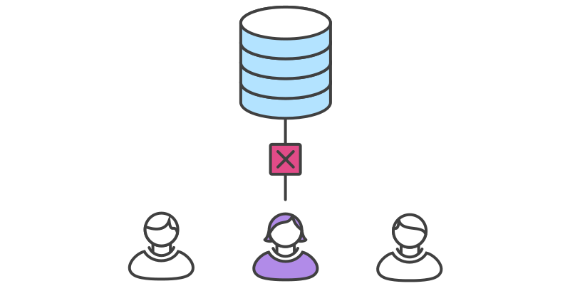

# Source Code Management

### Andrea Galbusera

***

gizero@gmail.com

[@gizero76](https://twitter.com/gizero76)

https://github.com/gizero

---

# The Speaker

embedded systems designer/architect

spare time full-stack web developer

doing SCM since 2002 (in some way teaching it)

using `git` since 2010

doing research into SCM technologies and best practices

---

This presentation is available at:

http://gizero.github.io/scm-course-ff3d/

Sources:

https://github.com/gizero/scm-course-ff3d/

---

# Agenda

## Day 1
- disclaimer
- what's this all about?
- (brief) history of SCM
- workshop

--->

# Agenda

## Day 2
- advanced workflows
- workshop

---

# Disclaimers

- work in progress teaching experiment
<!-- .element: class="fragment" data-fragment-index="1" -->

- many concept are tool agnostic...
<!-- .element: class="fragment" data-fragment-index="2" -->

- ...but this is about `git`
<!-- .element: class="fragment" data-fragment-index="3" -->

- client agnostic
<!-- .element: class="fragment" data-fragment-index="4" -->

- ...but heavily biased towards command line
<!-- .element: class="fragment" data-fragment-index="5" -->

Note: Avertenze

---

# In This Course We

- talk interactively to each other
- sketch some diagrams
- build a reasonable work flow strategy

---

# Then...

- you will learn the commands to implement it

Note: invece di concentrarsi sui comandi ci focalizzeremo maggiormente sul
perchè vogliamo fare qualcosa e poi su come implementarla. Useremo qualche
diagramma per stimolare gli stessi processi di apprendimento che normalmente
portano alcuni di noi a preferire le GUI rispetto alle interfacce CLI.

---

# Vocabulary

- Source Control
- Version Control
- Revision Control
- Source Code Management

Note: con il termine SCM comprendiamo anche pratiche e strumenti più o meno
correlati con il controllo di revisione, quali il deployment e il ticket/issue
tracking. Quindi vediamo cosa ci permettono di fare questi strumenti che rientrano
nella classificazione appena introdotta...

---

# With SCM tools we...

- keep track of changes over time
- backup older files
- work with others on a project simultaneously
- keep track of authorship
- deal with big (or even small) changes that break things
- move things from one host to another

---

# working solo?

- productivity tool
- easily switch between tasks
  + parallelizing activities
- quickly react to urgencies
  + make a quick fix while working on a new feature

---

# working in team?

- don't step on each other's feet
- minimize coordination overhead
- reduce onboarding costs for new resources
- leverage and improve team skills with peer review

---

# Authorship

- keep track of "who made what"
- allow "blaming" changesets

---

# do I really need a tool? (alternatives)

Frequently backup your files (caveman's SCM)

- straightforward: anyone knows how to do it
- error prone (write to wrong dir)
- what does frequently mean?
- how to deal with backups (housekeeping)
- hard to find useful things among backups
- doesn't solve the collaboration issue

---

# Distributed vs Centralized

--->

# Centralized VCS

- there is only one repository every contributor connects to
- there is a single history of revisions
- easy to administer and manage access control
- single point of failure

--->

# Centralized VCS

- SVN
- TFS
- CVS

--->

# Distributed VCS

- every contributor mirrors the entire history
- every clone is a full backup

--->

# Distributed VCS

- git
- Mercurial
- BitKeeper
- Veracity

---

## Distributed as the New Centralized

--->

## Integration Manager

--->

## Dictator and Lieutenants

---

# Exercise 1: outline your team

Who is in your team?

Note: dare un'idea di cosa vogliamo fare senza svelare i dettagli. Cerchiamo di
conoscere il team e il teamwork per caratterizzare i workflow di interesse.
Usiamo come riferimento un progetto reale che coinvolga un numero significativo
di persone oppure proviamo a immaginare un progetto imminente o anche fittizio
sul quale ragionare.

--->

# Exercise 1: outline your team

What are their roles?
+ developers
+ designers
+ project managers
+ clients

--->

# Exercise 1: outline your team

What task are they responsible for?
+ writing code
+ reviewing code
+ pushing code to servers
+ fixing broken code

Note: prendete carta e penna e scrivete i nomi delle persone coinvolte nel
progetto, indicando i loro ruoli e le attività delle quali sono responsabili:
utilizzando i verbi come download work, create snapshot, share work

--->

# Exercise 1: outline your team

What constraints are you dealing with?
+ how do you schedule your deadlines?
+ where is your code hosted?
+ do you have a staging instance?
+ where are the server you push to?
+ do you use a local development pattern?

Note: I tricked you and you just built a checklist for what they need to create
a workflow they can use with git

---

# A Simple Workflow
Shared repository with two contributors

--->

## A Restricted Access Workflow
Contributor have no access to the main repository

---

# Interlude - VCS and the ecosystem

- ticket driven development (issue tracking)
- milestones
- code review
- QA (testing strategies)
- releases, versioning scheme

--->

# Interlude - VCS and the ecosystem

- deployment strategies
- documentation (GitHub pages, wikis)
- continuous integration (CI)
- continuous deployment

Note: abbiamo delineato in linea di massima chi fa cosa. Ora iniziamo a vedere
in che modo possiamo affrontare le situazioni che tipicamente si presentano
durante lo sviluppo di un progetto.

---

# Workflows

- the world is non-linear
- your work is no exception
- need to manage complexity
- branches help keeping different tasks separated

# Centralized Workflow

--->

# Centralized WF

--->

# Centralized WF

--->

# Centralized WF

--->

# Centralized WF

--->

# Centralized WF

--->

# Centralized WF

--->

# Centralized WF

--->

# Centralized WF

---

# Release schedule

Release frequency influences the branching strategy

The more often you release, the more you need to be using branches to manage
things

---

# Desktop-like software

- few months to a year between releases
- every release involves significant overhead
- different versions installed at the same time
- need to support more then one release

--->

# Desktop-like software

## one branch per release

--->

# Desktop-like software

## consolidation branches

--->

# Desktop-like software

## ready to release!

--->

# Desktop-like software

## oops: here comes the bug

--->

# Desktop-like software

## non-trivial features

---

# Web Applications

- little overhead for releasing
- releasing means deploying
- user often unaware of versioning
- usually only one version is maintained

--->

# Web Applications

--->

# Web Applications

- more importance to feature branches
- continuous deployment with automation
- support transparent rollback

---

# Why the command line interface

It's a matter of taste but:
- as a programmer I don't trust GUIs
- it's elegant (clicking here and there becomes boring)
- allows progressively replacing yourself with scripts (automation)
- easier to write cheat sheets, share knowledge and ask the web for help (Stack Overflow)

---

# Bootstrap

    $ git init .

<!-- .element: class="fragment" data-fragment-index="1" -->

    $ git add .

<!-- .element: class="fragment" data-fragment-index="2" -->

    $ git commit -m "This is my first commit"

<!-- .element: class="fragment" data-fragment-index="3" -->

---

# Best Practices

Always run 'diff' before committing

--->

# Best Practices

Read diffs from other developers

- you can learn something
- informal review

--->

# Best Practices

Keep your repos as small as possible

- minimal set of "sources"
- never store generated files
- store content, not representations

--->

# Best Practices

Organize commits into logically related changes

- no more than one "task" per commit
- no less then one "task" per commit

--->

# Best Practices

Commit log messages

--->

# Best Practices

Don't comment code: just delete it

- tools allow for easy recovery if needed
- keep things more readable
- can have performance inpact in sources for the web
