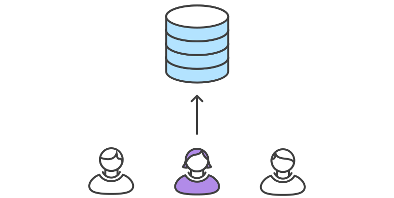
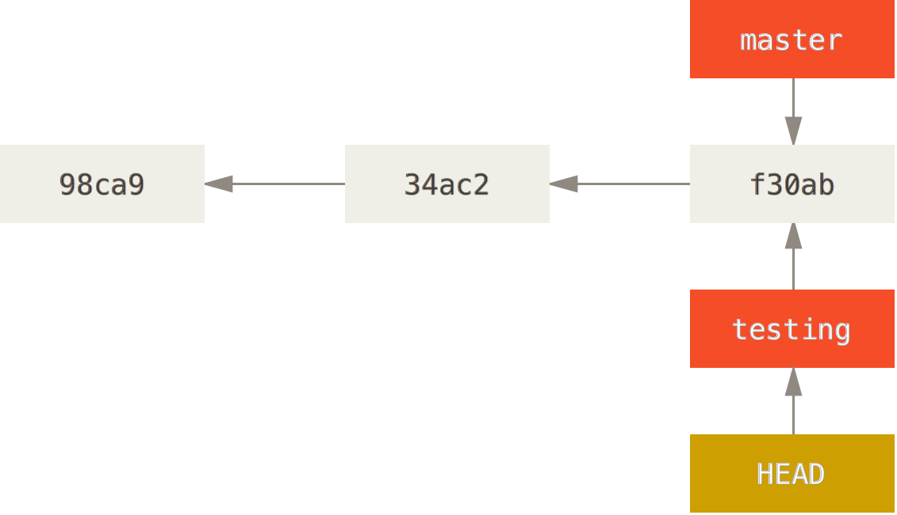

# Source Code Management

### Andrea Galbusera

***

gizero@gmail.com

[@gizero76](https://twitter.com/gizero76)

https://github.com/gizero

---

# The Speaker

embedded systems designer/architect

spare time full-stack web developer

doing SCM since 2002 (in some way teaching it)

using `git` since 2010

doing research into SCM technologies and best practices

---

This presentation is available at:

http://gizero.github.io/scm-course-ff3d/

Sources:

https://github.com/gizero/scm-course-ff3d/

---

# Agenda

## Day 1
- disclaimer
- what's this all about?
- (brief) history of SCM
- workshop

--->

# Agenda

## Day 2
- advanced workflows
- workshop

---

# Disclaimers

- work in progress teaching experiment
<!-- .element: class="fragment" data-fragment-index="1" -->

- many concept are tool agnostic...
<!-- .element: class="fragment" data-fragment-index="2" -->

- ...but this is about `git`
<!-- .element: class="fragment" data-fragment-index="3" -->

- client agnostic
<!-- .element: class="fragment" data-fragment-index="4" -->

- ...but heavily biased towards command line
<!-- .element: class="fragment" data-fragment-index="5" -->

Note: Avertenze

---

# In This Course We

- talk interactively to each other
- sketch some diagrams
- build a reasonable work flow strategy

---

# Then...

- you will learn the commands to implement it

Note: invece di concentrarsi sui comandi ci focalizzeremo maggiormente sul
perchè vogliamo fare qualcosa e poi su come implementarla. Useremo qualche
diagramma per stimolare gli stessi processi di apprendimento che normalmente
portano alcuni di noi a preferire le GUI rispetto alle interfacce CLI.

---

# Vocabulary

- Source Control
- Version Control
- Revision Control
- Source Code Management

Note: con il termine SCM comprendiamo anche pratiche e strumenti più o meno
correlati con il controllo di revisione, quali il deployment e il ticket/issue
tracking. Quindi vediamo cosa ci permettono di fare questi strumenti che rientrano
nella classificazione appena introdotta...

---

# With SCM tools we...

- keep track of changes over time
- backup older files
- work with others on a project simultaneously
- keep track of authorship
- deal with big (or even small) changes that break things
- move things from one host to another

---

# working solo?

- productivity tool
- easily switch between tasks
  + parallelizing activities
- quickly react to urgencies
  + make a quick fix while working on a new feature

---

# working in team?

- don't step on each other's feet
- minimize coordination overhead
- reduce onboarding costs for new resources
- leverage and improve team skills with peer review

---

# Authorship

- keep track of "who made what"
- allow "blaming" changesets

---

# do I really need a tool? (alternatives)

Frequently backup your files (caveman's SCM)

- straightforward: anyone knows how to do it
- error prone (write to wrong dir)
- what does frequently mean?
- how to deal with backups (housekeeping)
- hard to find useful things among backups
- doesn't solve the collaboration issue

---

# Distributed vs Centralized

--->

# Centralized VCS

- there is only one repository every contributor connects to
- there is a single history of revisions
- easy to administer and manage access control
- single point of failure

--->

# Centralized VCS

- SVN
- TFS
- CVS

--->

# Distributed VCS

- every contributor mirrors the entire history
- every clone is a full backup

--->

# Distributed VCS

- git
- Mercurial
- BitKeeper
- Veracity

---

## Distributed as the New Centralized

--->

## Integration Manager

--->

## Dictator and Lieutenants

---

# Exercise 1: outline your team

Who is in your team?

Note: dare un'idea di cosa vogliamo fare senza svelare i dettagli. Cerchiamo di
conoscere il team e il teamwork per caratterizzare i workflow di interesse.
Usiamo come riferimento un progetto reale che coinvolga un numero significativo
di persone oppure proviamo a immaginare un progetto imminente o anche fittizio
sul quale ragionare.

--->

# Exercise 1: outline your team

What are their roles?
+ developers
+ designers
+ project managers
+ clients

--->

# Exercise 1: outline your team

What task are they responsible for?
+ writing code
+ reviewing code
+ pushing code to servers
+ fixing broken code

Note: prendete carta e penna e scrivete i nomi delle persone coinvolte nel
progetto, indicando i loro ruoli e le attività delle quali sono responsabili:
utilizzando i verbi come download work, create snapshot, share work

--->

# Exercise 1: outline your team

What constraints are you dealing with?
+ how do you schedule your deadlines?
+ where is your code hosted?
+ do you have a staging instance?
+ where are the server you push to?
+ do you use a local development pattern?

Note: I tricked you and you just built a checklist for what they need to create
a workflow they can use with git

---

# A Simple Workflow
Shared repository with two contributors

--->

## A Restricted Access Workflow
Contributor have no access to the main repository

---

# Interlude - VCS and the ecosystem

- ticket driven development (issue tracking)
- milestones
- code review
- QA (testing strategies)
- releases, versioning scheme

--->

# Interlude - VCS and the ecosystem

- deployment strategies
- documentation (GitHub pages, wikis)
- continuous integration (CI)
- continuous deployment

Note: abbiamo delineato in linea di massima chi fa cosa. Ora iniziamo a vedere
in che modo possiamo affrontare le situazioni che tipicamente si presentano
durante lo sviluppo di un progetto.

---

# Workflows

- the world is non-linear
- your work is no exception
- need to manage complexity
- branches help keeping different tasks separated

---

# Release schedule

Release frequency influences the branching strategy

The more often you release, the more you need to be using branches to manage
things

---

# Desktop-like software

- few months to a year between releases
- every release involves significant overhead
- different versions installed at the same time
- need to support more then one release

--->

# Desktop-like software

## one branch per release

--->

# Desktop-like software

## consolidation branches

--->

# Desktop-like software

## ready to release!

--->

# Desktop-like software

## oops: here comes the bug

--->

# Desktop-like software

## non-trivial features

---

# Web Applications

- little overhead for releasing
- releasing means deploying
- user often unaware of versioning
- usually only one version is maintained

--->

# Web Applications

--->

# Web Applications

- more importance to feature branches
- continuous deployment with automation
- support transparent rollback

---

# Centralized Workflow

--->

# Centralized WF

- flat learning curve for CVCS users
- allows isolated environment
- forget about upstream until convenient
- cheap and robust branch & merging

--->

# Centralized WF

--->

# Centralized WF

--->

# Centralized WF

--->

# Centralized WF

--->

# Centralized WF

--->

# Centralized WF

--->

# Centralized WF

--->

# Centralized WF

---

# Why the command line interface

It's a matter of taste but:
- as a programmer I don't trust GUIs
- it's elegant (clicking here and there becomes boring)
- allows progressively replacing yourself with scripts (automation)
- easier to write cheat sheets, share knowledge and ask the web for help (Stack Overflow)

---

## What should I configure?
##### Identity

    $ git config --global user.name "John Doe"
    $ git config --global user.email johndoe@example.com

##### Editor

    $ git config --global core.editor vim

##### Merge tool - don't change this if you're not sure

    $ gif config --global merge.tool vimdiff

##### Check current settings

    $ git config --list
    $ git config user.name

---

# Where are my settings?
- System setting       : `/etc/gitconfig`
- Global user settings : `~/.gitconfig`
- Repository settings  : `.git/config`
- Windows: `C:\Documents and Settings\$USER\.gitconfig`

---

# Get Help

    $ git

    $ git help

    $ git help clone

---

# Preview

    $ git init

<!-- .element: class="fragment" data-fragment-index="1" -->

    $ git add file

<!-- .element: class="fragment" data-fragment-index="2" -->

    $ git commit -m "This is my first commit"

<!-- .element: class="fragment" data-fragment-index="3" -->

---

# Work on existing project

    $ git clone https://github.com/gizero/scm-course-ff3d

---

# The Three States

---

# Lifecycle of the status

---

# Check file status

    $ git status
 
+ Untracked - changes are not recorded by git
+ Tracked
    + unmodified - no changes since last snapshot
    + modified - modified since last snapshot
    + staged - a modified snapshot which is ready for commit

--->

# Check file status
    $ git status
    # On branch master
    nothing to commit (working directory clean)
 
## After creating a new file
    $ touch README
    $ git status
    # On branch master
    # Untracked files:
    #   (use "git add <file>..." to include in what will be committed)
    #
    #   README
    # nothing added to commit but untracked files present (use "git add" to
    # track)

--->

# Adding a file
    $ git add README
 
## Check the status again
    $ git status
    # On branch master
    # Changes to be committed:
    #   (use "git reset HEAD <file>..." to unstage)
    #
    #   new file:   README
    #

--->

# Modify tracked file
    $ vim index.html
 
## What's the status now?
    $ git status
    # On branch master
    # Changes to be committed:
    #   (use "git reset HEAD <file>..." to unstage)
    #
    #   new file:   README
    #
    # Changes not staged for commit:
    #   (use "git add <file>..." to update what will be committed)
    #
    #   modified:   index.html
    #

--->

# Stage Changes
    $ git add index.html
 
## And the status?
    $ git status
    # On branch master
    # Changes to be committed:
    #   (use "git reset HEAD <file>..." to unstage)
    #
    #   new file:   README
    #   modified:   index.html
    #

--->

# git add

- git add to track new files
- git add to stage files
- git add to mark conflicts as resolved

Note: add is a multipurpose command

--->

# Check changes
    $ git diff          # changes still unstaged
    $ git diff --cached # changes staged to commit

--->

# Time to Commit
    $ git commit -m "That's fun, isn't it?"

--->

# All in One
    $ git commit -a -m "fix stuff"
 
This will stage and commit the files in a single operation

--->

# Fix last commit
    $ git commit --ammend

--->

# Removing files
    $ git rm file.txt          # removes from repo & working directory
    $ git rm --cached file.txt # removes from repo

--->

# Moving and renaming files
    $ git mv file_from file_to
 
Is just a shorthand for:

    $ mv README.txt README
    $ git rm README.txt
    $ git add README

--->

# Ignoring files
    $ vim .gitignore
IDE files, build dir, local settings, etc...

--->

# View the commit history
    $ git log

--->

# Removing a file from the staging area
    $ git reset <filename>

--->

# Undo file changes
    $ git checkout <filename>

--->

# Remotes
## List remotes
    $ git remote -v
## Add a remote
    $ git remote add <name> <url>

--->

## Fetch changes from remote
    $ git fetch <remote>
 
## Fetch + Merge with branch
    $ git pull <remote> <branch>
 
## Pushing
    $ git push <origin> <branch>

---

# Branching & Merging

--->

## How git stores a commit?

--->

## How does git stores many commits?

--->

## A branch is a pointer

--->

## Multiple branches

--->

## Which branch I'm on?

## HEAD

--->

## Which branch I'm on?

## HEAD

--->

# Recap

## commit consists of
- Message
- Author
- Commiter
- Date
- Pointer to tree (snapshot)
- Pointer to previous commits

--->

# Recap

## branches
- lightweight movable pointer to one commit
- when you commit, the branch moves forward, pointing to the new commit

Note: branch in git is actuality a simple file that contains the 40 character SHA–1 checksum of the commit it points to

--->

## Branching is inexpensive
- creating a new branch is just creating another pointer
- creating a new branch is as quick as writing 41 bytes to a file (40 characters and a newline)
- branching is a **local** operation, no server communication is needed
- switching branches changes the files in the working directory
- a special pointer called HEAD always points to the current branch

--->

### Create a branch
    $ git branch <branch_name>
### Delete a branch
    $ git branch -d <branch_name>
### Move to another branch
    $ git checkout <branch_name>
### Create a branch and switch to it
    $ git checkout -b <branch_name>
### List branches
    $ git branch

--->

# Some examples of branching models

--->

# Topic branches

You should branch everytime you do something new

- Fixes
- Features
- Experiments

--->

## Long-running branches
 
### If you do not care about versions
+ Keep master stable!

 
### If you want to release specific versions
+ Develop on master
+ Branch to stable release versions
+ Fix bugs on release versions branches and merge onto master
+ Never merge master onto release version branches

--->

--->

## The scenario
+ Do work on a web site
+ Create a branch for a new story you’re working on
+ Do some work in that branch

 

## James calls (angry) for a hotfix
+ Revert back to your production branch
+ Create a branch to add the hotfix
+ After it’s tested, merge the hotfix branch, and push to production
+ Switch back to your original story and continue working

--->

## In the begining...

--->

## Time to start working on issue #53
    $ git checkout -b iss53
    Switched to a new branch "iss53"

--->

## Do some work
    $ vim index.html
    $ git commit -a -m 'added a new footer [issue 53]'

--->

## James calls - Let's get back to master
    $ git checkout master
    Switched to branch "master"

--->

## Fixing the problem
    $ git checkout -b hotfix
    Switched to a new branch "hotfix"
    $ vim index.html
    $ git commit -a -m 'fixed the broken email address'
    [hotfix]: created 3a0874c: "fixed the broken email address"
     1 files changed, 0 insertions(+), 1 deletions(-)

--->

## Ready to production? - Merge to master
    $ git checkout master
    $ git merge hotfix
    Updating f42c576..3a0874c
    Fast forward
     index.html |    1 -
     1 files changed, 0 insertions(+), 1 deletions(-)

--->

## Let's continue working on issue #53
    $ git checkout iss53
    Switched to branch "iss53"
    $ vim index.html
    $ git commit -a -m 'finished the new footer [issue 53]'
    [iss53]: created ad82d7a: "finished the new footer [issue 53]"
     1 files changed, 1 insertions(+), 0 deletions(-)

--->

## Time to merge into master
    $ git checkout master
    $ git merge iss53
    Merge made by recursive.
     index.html |    1 +
     1 files changed, 1 insertions(+), 0 deletions(-)

--->

## The end result

--->

--->

## You are...
    $ git merge iss53
    Auto-merging index.html
    CONFLICT (content): Merge conflict in index.html
    Automatic merge failed; fix conflicts and then commit the result.

 

## Checking the status
    $ git status
    index.html: needs merge
    # On branch master
    # Changes not staged for commit:
    #   (use "git add <file>..." to update what will be committed)
    #   (use "git checkout -- <file>..." to discard changes in working directory)
    #
    #   unmerged:   index.html
    #

--->

## Conflict example
    <<<<<<< HEAD:index.html
    
Awesome!

    =======
    

        Wunderbar!
    

    >>>>>>> my-other-branch:index.html

__Remember:__ `HEAD` is was what you had checked out when you ran your merge command

--->

## Mark file as resolved
    $ git add <filename>
 
## Graphical tool to solve the issues
    $ git mergetool
 
## Continue merge after solving conflicts
    $ git commit

--->

## Rebasing

Reapplying a diverging branch onto another

    git checkout <diverging_branch>
    git rebase master

After rebasing, a merge of master with diverging_branch will fast-forward master

--->

## How rebase works
1. Finds the common ancestor of the two branches (base)
2. Gets the diff of each commit of the branch you’re on, from the base
3. Saves those diffs to temporary files
4. Resets the current branch to the same commit as the branch you are rebasing onto
5. Applies each change (diff) in turn

--->

## Care to give an example?

--->

## Merge

--->

## Rebase - Step #1
    $ git checkout experiment
    $ git rebase master
    First, rewinding head to replay your work on top of it...
    Applying: added staged command

--->

## Rebase - Step #2
    $ git checkout master
    $ git merge experiment

--->

## A more interesting rebase

--->

## Integrate the client changes to master

--->

## Rebasing fundamentals

> Rebasing replays changes from one line
> of work onto another in the order they
> were introduced, whereas merging takes 
> the endpoints and merges them together.

__The only difference between merging and rebasing is the resulting history__

--->

--->

## Tips
+ Don't be afraid to branch and merge frequently
+ At the begining, ad if you're working on the same branch: ignore rebase

## Like this
    $ git commit -m "Fancy message" // Many of these
    $ git pull origin develop       // This merges. Simpler
    $ git push origin develop       // Push commits
---

# Branching model

--->

## A branching model allows you to...

+ Release your code more frequently
+ Keep a production ready state of your product
+ Don't wait for nobody to push that hotfix
+ Better collaborate on features

--->

## A successful/common model

---

# Tools?

---

# For the future

+ Stashing
+ Cherry-pick
+ Interactive staging
+ Interactive rebasing

---

# Conclusions

--->

## Not so good things

+ It's different
+ It will take some time to get the handle
+ You wont spend 2 hours doing merges anymore :-)

--->

## Good things

+ You shouldn't use git (or other VCS) to just 'save your work' at the end of the day
+ Craft your commits - it will help you
+ Treating commits as snapshots brings advantages
+ Branch and Merge are friends - __don't be afraid of them!__

--->

# Best Practices

Always run 'diff' before committing

--->

# Best Practices

Read diffs from other developers

- you can learn something
- informal review

--->

# Best Practices

Keep your repos as small as possible

- minimal set of "sources"
- never store generated files
- store content, not representations

--->

# Best Practices

Organize commits into logically related changes

- no more than one "task" per commit
- no less then one "task" per commit

--->

# Best Practices

Commit log messages

--->

# Best Practices

Don't comment code: just delete it

- tools allow for easy recovery if needed
- keep things more readable
- can have performance inpact in sources for the web

--->

## Regarding commit messages
+ Are in the present tense
+ Start with a capitalized letter
+ Have a subject that does not exceed 50 chars
+ Have a thourough message body that explains in detail what was changed and why. This message is linewrapped at 72 chars.

